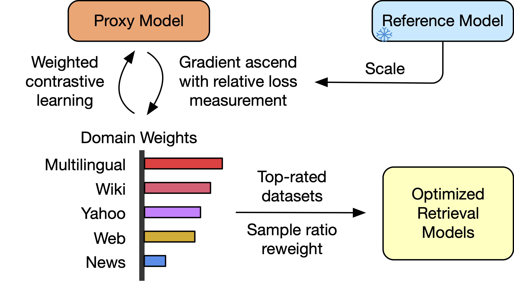

# tDRO
[](https://arxiv.org/abs/2408.10613)

Source codes for research paper: 

[Task-level Distributionally Robust Optimization for Large Language Model-based Dense Retrieval](https://arxiv.org/abs/2408.10613), Guangyuan Ma, Yongliang Ma, Xing Wu, Zhenpeng Su, Ming Zhou and Songlin Hu.

This paper proposes a new task-level Distributionally Robust Optimization (tDRO) algorithm for Large Language Model-based Dense Retrieval (LLM-DR) fine-tuning, targeted at improving the universal domain generalization ability by end-to-end reweighting the data distribution of each task.


<div align=center>
    
<!--     <center>Task-level Distributionally Robust Optimization for Large Language Model-based Dense Retrieval</center> -->
</div>

## Environment Setup
Please install [Faiss-GPU](https://github.com/facebookresearch/faiss/blob/main/INSTALL.md) by following their guidelines. Then you can easily set up the environment by cloning this repo, and runing the following command.
 <!-- and [Apex](https://github.com/NVIDIA/apex)  -->

```bash
pip install -e .
```


## Model Release
All models and datasets will be released soon.


## Data Preparation

**Dataset Cards**: [data/README.md](data/README.md)

A total of 25 heterogeneous retrieval fine-tuning datasets with **Hard Negatives** and **Deduplication** (with test sets) are used as the fine-tuning collections of our experiments. Please refer to the above [Dataset Cards](data/README.md) for details.

1. **Dataset sources**: All Datasets are made from open-sourced retrieval fine-tuning collections. Most of them (except several multilingual or Chinese datasets) are originated from [Sentence Transformers Training Data](https://huggingface.co/datasets/sentence-transformers/embedding-training-data). Please find their references at the *Reference* column of [Dataset Cards](data/README.md).
2. **Language**: *21 datasets* are mono-lingual English datasets. *2 datasets* (DuReader and T2Ranking) are mono-lingual Chinese datasets. And *2 datasets* (MIRACL and Mr.Tydi) are multilingual datasets.
3. **Category and Symmetry**: In order to enable the diversity of heterogeneous collections, the fine-tuning data covers *13 categories* and *2 symmetry*.
4. **Format**: The format and source of training triples are also listed in the [Dataset Cards](data/README.md), which follows the basic format of (Query, Postive, Negatives).
5. [**HN Mine**](data/HN_mine.md): All datasets have been processed with Hard Negative (HN) Mining. For 4 multilingual or Chinese datasets (MIRACL, Mr.Tydi, DuReader and T2Ranking), we directly use the originally provided HN. For MS-MARCO Passage Rankining, NQ and Trivia datasets, we follow the data preparation scripts provided with [bowdpr](https://github.com/ma787639046/bowdpr). For AllNLI and Quora duplicates triplets, we directly use the negatives from [Sentence Transformers Training Data](https://huggingface.co/datasets/sentence-transformers/embedding-training-data). For the remaining mono-lingual English datasets, we utilize the [bge-base-en-v1.5](https://huggingface.co/BAAI/bge-base-en-v1.5) retriever to mine the hard negatives. Please follow [`data/HN_mine.md`](data/HN_mine.md) to reproduce our *HN mine* pipeline.
6. [**Deduplication**](data/inspect_duplicates.py): To avoid test label leak on the training collections, we deduplicate all training datasets with SimHash. Please refer to [`data/inspect_duplicates.py`](data/inspect_duplicates.py) for detailed deduplication implemention.


## Training Procedure
The whole training procedure for tDRO involves 3 stages.

### Stage 0: Baseline Retriever Model (Reference Model) Training
**Script**: [`s0_train_baseline_model.sh`](scripts/s0_train_baseline_model.sh)

First, train a baseline model (which is also the reference model) with uniform weight sampling. Please refer to the above script to reproduce. The model will be saved in `results/s0_train_baseline_model` with the above script by default.

**Note**: Our LLM-based retrievers rely on last token pooling, which requires add a `</eos>` at the end of tokenized texts. However, `Qwen1.5` & `LLaMA3` base models can NOT add a `</eos>` correctly when `tokenizer.add_eos_token==True`. 

We have modified the `post_processor` in coresponding `tokenizer.json` to support add `</eos>`. Please use the modified tokenizer `tokenizer.json` in following files:

1. **Qwen1.5**: [`scripts/qwen1.5-tokenizer.json`](scripts/qwen1.5-tokenizer.json)
2. **LLaMA3**: [`scripts/llama3-8b-tokenizer.json`](scripts/llama3-8b-tokenizer.json)


### Stage 1: tDRO Optimization
**Script**: [`s1_tdro.sh`](scripts/s1_tdro.sh)

Task-level Distributionally Robust Optimization (tDRO) optimizes over heterogeneous training collections to find robust weights for contrastive fine-tuning a retriever. This stage requires a proxy model (which interleaves its own update with weight updates) and a trained reference model (same size with the proxy model). After tDRO Optimization, several robust optimized weights are saved in the model output dictionary `results/s1_tdro` by default:

1. `curr_weights.json`: The final weights at the last step of tDRO.
2. `topxx_weights.json`: The top xx% tasks with a uniform sampling weights. In our paper, we take the `top70_weights.json` for optimal performances.

Additionally, the averaged weights `mean_weights.json` or EMA-averaged weights `ema_weights.json` over all tDRO steps are also provided for references. These two weights are not used in our experiments.

### Stage 2: Robust Retriever Model Training
**Script**: [`s2_train_optimized_model.sh`](scripts/s2_train_optimized_model.sh)

Robust retriever models are trained with the same hyperparameter settings with baseline model. The only difference is that robust models adapt the tDRO optimized weights from the above stage.

1. `curr_weights.json`: To use the final weights at the last step of tDRO, please call `bash s2_train_optimized_model.sh curr`.
2. `top70_weights.json`: To use the top 70% tasks with a uniform sampling weights, please call `bash s2_train_optimized_model.sh top70`.


## Evaluation
Please refer to [`eval/README.md`](eval/README.md) for more details.


## Bugs or Questions
If you encounter any bugs or questions, please feel free to email me or open an issue.

**Contacts**: Guangyuan Ma (maguangyuan@iie.ac.cn)


## Acknowledgement
Our codebase are inspired by several excellent open-sourced projects. We want to give special thanks to [bowdpr](https://github.com/ma787639046/bowdpr), [Tevatron](https://github.com/texttron/tevatron), [COCO-DR](https://github.com/OpenMatch/COCO-DR/tree/main#Usage), [Mistral-E5](https://github.com/microsoft/unilm/blob/master/e5/README.md), [FlagEmbedding](https://github.com/FlagOpen/FlagEmbedding), and so on.


## Cite
If you are interested in our work, please consider citing our paper.

```bibtex
@article{ma2024tdro,
  author       = {Guangyuan Ma and
                  Yongliang Ma and
                  Xing Wu and
                  Zhenpeng Su and
                  Ming Zhou and
                  Songlin Hu},
  title        = {Task-level Distributionally Robust Optimization for Large Language
                  Model-based Dense Retrieval},
  journal      = {CoRR},
  volume       = {abs/2408.10613},
  year         = {2024},
  url          = {https://doi.org/10.48550/arXiv.2408.10613},
  doi          = {10.48550/ARXIV.2408.10613},
  eprinttype    = {arXiv},
  eprint       = {2408.10613},
  timestamp    = {Tue, 24 Sep 2024 17:36:32 +0200},
}
```


## License
tDRO is licensed under the [Apache License](LICENSE).

